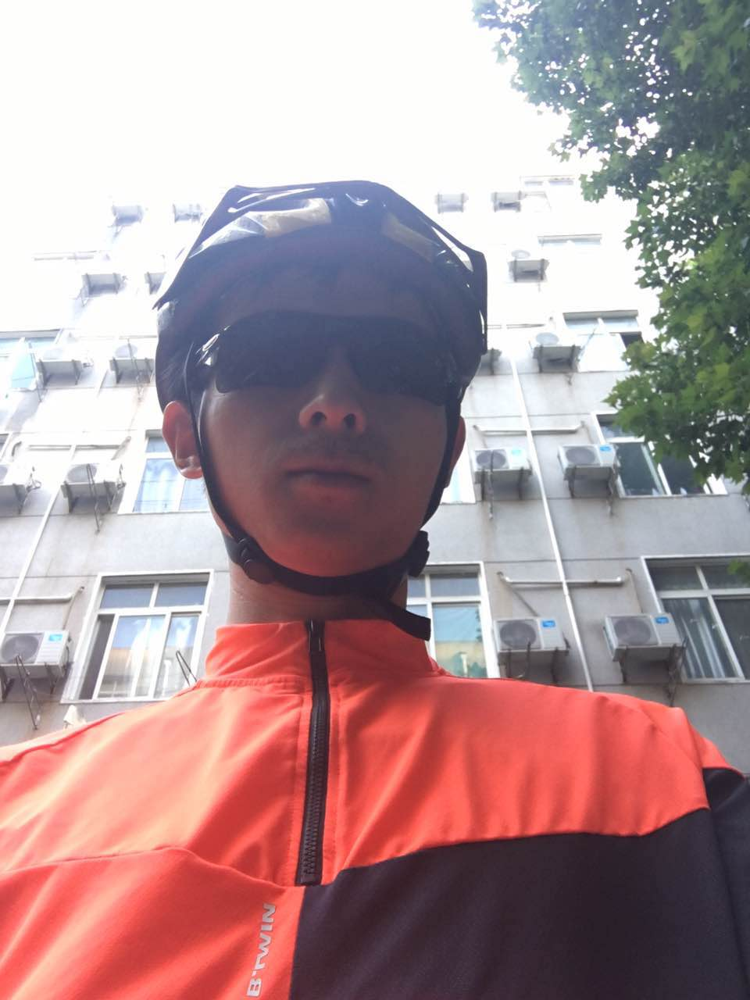

# 卢巍(Wei Lu)

I’m a Ph.D. Studnet majoring in Cartography and Geographic Information Engineering at Wuhan University. My research interests center on Cartography, Geographic Information Science. My work now focus on volunteered geographic information(VGI), geovisualization and web mapping.

## Contact Information
* **Address**
  - EN:  
        Room 506, School of Resource & Environment Sciences, 
        Wuhan Univ. No.129, Luoyu Rd. Wuhan, 
        Hubei, P. R. China, 430079  
  - 中文: 
        湖北省 武汉市 武汉大学 资源与环境科学学院 506实验室，430079
* **Email**: whuluwei@whu.edu.cn &sdot; whuluwei@gmail.com

## More About Me
* Resume: [English](pages/resume.en.html) &sdot; [中文](pages/resume.zh.html) &sdot; [PDF](static/resume.pdf)
* Links: [ResearchGate](https://www.researchgate.net/profile/Wei_Lu77) &sdot; [GeoInsights](http://geoinsights.xyz) &sdot; [知乎](https://zhihu.com/people/luwei14) &sdot; [GitHub](https://github.com/luwei14)
