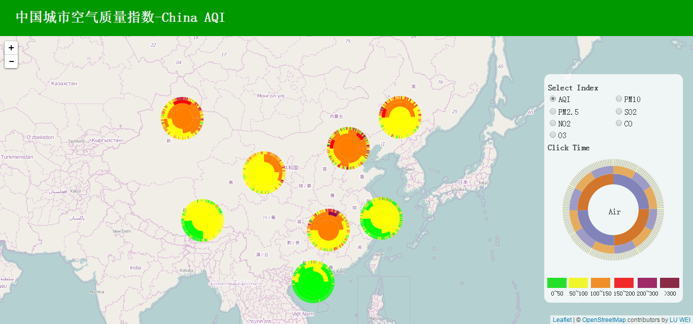

% Mapping Air Quality of China, 2014
% 2015-10-23

# Mapping Air Quality of China, 2014
Recently, I have developed a web mapping application for visualizing the air quality of major cities in China, 2014. Please refer to [Air Map, 2014](http://lw1990.name/airmap/). On Nov. 1st, I made a presentation about this work in the Ph.D. Forum at China Universtiy of Geosciences. The slides: [PDF](../static/upload/airvisz.pdf).

# Air Now, China
You can view real time air quality of China here [Air Now](http://mapviz.xyz:8080)
