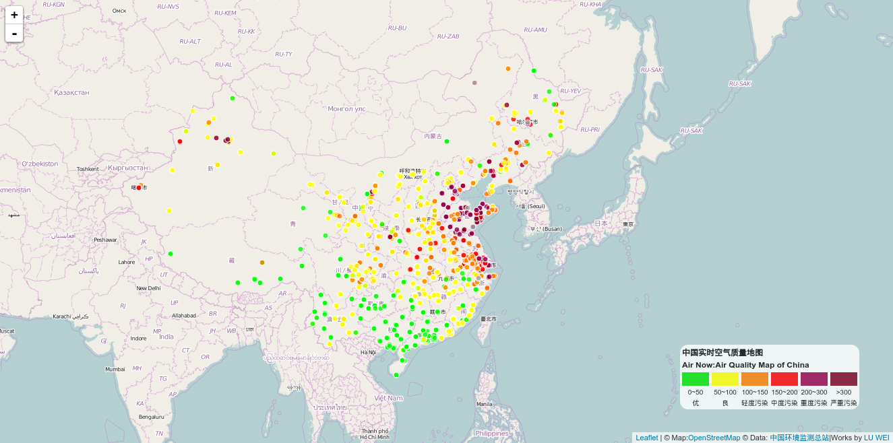

% Air Now of Cities in China
% 2016-01-23
# Air Now of Cities in China
鉴于本人所在城市进入了一个接近1个月时间的空气质量乱纪元，想了解全国实时空气质量状况，最近利用国家环境监测总站的空气质量数据制作了一个实时空气质量地图。环保部有一个实时地图应用，为什么要自己做一个呢？只是因为，环保部那个地图应用所依赖的技术导致无法使用IE内核以外的浏览器查看。

转到：[Air Now](http://mapviz.xyz:8080/)

转到：[Air Map, 2014](http://lw1990.name/airmap/)

